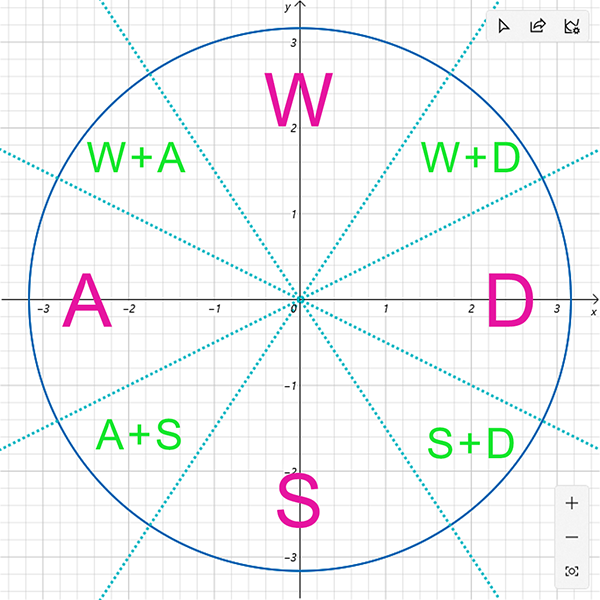
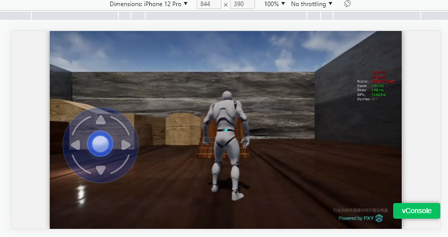

# PXY Common WebUI

---

[English](./README.md) [中文](./README.zh_CN.md)

---

* Joystick component, fro virtual joystick UI, when config [larksr](https://www.npmjs.com/package/larksr_websdk) object to this component, auto send operate command to cloud rendering.

## Quick Start

### Install

1. npm

```cmd
npm i pxy_webcommonui
```

2. plain html

```html
<script src="pxy_webcommonui.min.js"></script>
```

### Use

#### Pacakge Name

1. import [./test/App.tsx](./test/App.tsx)

```typescript
import PxyCommonUI from 'pxy_webcommonui';
const { 
  Joystick, 
  KJoystickEvents,
  KJoystickSubTypes
} = PxyCommonUI;
```

2. Plain html import to global object `pxy_webcommonui`, use `new pxy_webcommonui.Joystick({...config})` to create, see[./sample-plain-html/source/index.html](./sample-plain-html/source/index.html)

#### Joystick Component

Use `import` as exp:

```typescript
this.joystick = new Joystick({
    // root html element. 
    rootElement: this.uiContainerRef.current, 

    // Option，larksr object，create with larksr websdk
    // If set auto send operate command to cloud, or use callback joystickstart joystickmove joystickend.
    // npm https://www.npmjs.com/package/larksr_websdk
    // doc https://github.com/ParaverseTechnology/lark_sr_websdk_demos
    // demos https://ParaverseTechnology.github.io/webclient_sdk/
    larksr: this.larksr,

    // Option subType  1 wasd  2 updownleftright 3 joystick 0 none
    // Joystick type
    // 1 Keyboard WASD key
    // 2 Keyboard UpDownLeftRight Key
    // 3 Joystick
    // 0 None
    // 默认为 1
    subType: 1,

    // Option, component position
    // If not set use parent position.
    position: {
        top: 150,
        left: 100,
    },

    // Option, component size
    // If not set use parent html element size.
    size: {
        width: 200, 
        height: 200,
    },

    // Option, component center point size.
    // Default = total width 25%
    centerSize: {
        width: 100,
        height: 100,
    },

    // Option，extral style css.
    extralJoystickStyle: 'background-color: red;',

    // Option, extral center point css style.
    extralCenterStyle: 'background-color: #fff;',

    // Option, background url. set within css prop background-image
    joystickBackgroundUrl: "",

    // Option，center point background url，set within css prop background-image
    centerBackgroundUrl: "",

    // Option，send command interval.
    repeatTimeout: 10,
});
```

Destory Joystick:

```typescript
// Destory joystick DOM element.
this.joystick.destroy();
```

Listen event.

```typescript
this.joystick.on(KJoystickEvents.EVENTS_JOYSTICK_START, function(e) {
    console.log("joystickstart", e.detail);
});
this.joystick.on(KJoystickEvents.EVENTS_JOSYTICK_MOVE, function(e) {
    console.log("joystickmove", e.detail);
});
this.joystick.on(KJoystickEvents.EVENTS_JOYSTICK_END, function(e) {
    console.log("joystickend", e.detail);
});
```

> Generally two way to use this component. Use fixd position size or parent html element position size.

#### Other

```typescript
/**
 * Refresh component size.
 */
public resize()
/**
 * Show component.
 */
public show()
/**
 * Hide component.
 */
public hide()
```

### Send command (WASD) and Joystick touch position.



#### Keyboard Component

Use `import` as exp:

```typescript
this.keyboard = new Keyboard({
    // root html element. 
    rootElement: this.uiKeyboardRef.current, 
    
    // must set larksr object
    larksr: this.larksr,

    // zh en
    language: 'En',

    theme: 'dark'
});
```


```typescript
// show virtual keyboard
this.keyboard.show();

// hide virtual keyboard
this.keyboard.hide();
```

Listen event for input text.

```typescript
this.keyboard.on('keyboardVal', function(e) {
    console.log('e',e.detail);
});
```

## Debug

1. Running test, config [./test/App.tsx](./test/App.tsx) larksr object.

```bash
yarn run dev
```



2. Release

```bash
yarn run dist
```
