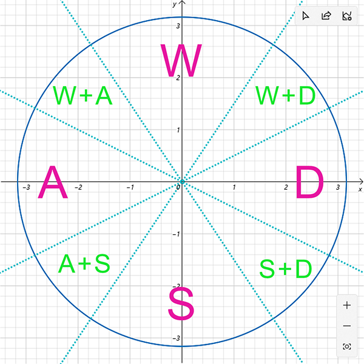
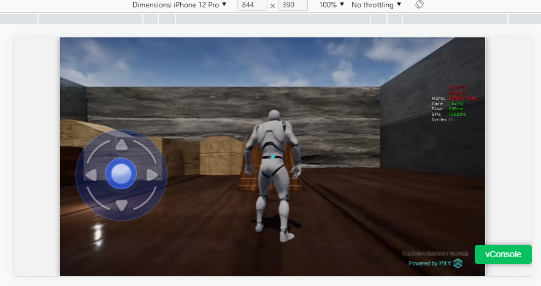

# PXY 通用组件

* Joystick 组件，移动端模拟摇杆 UI，可配置 [larksr](https://www.npmjs.com/package/larksr_websdk) 对象自动对应相应的云端应用操作。

## 快速接入

### 安装

1. npm 方式

```cmd
npm i pxy_webcommonui
```

2. 直接引入

```html
<script src="pxy_webcommonui.min.js"></script>
```

### 使用

#### 包名

1. import 方式引入方式，引入组件, 参考[./test/App.tsx](./test/App.tsx)

```typescript
import PxyCommonUI from 'pxy_webcommonui';
const { 
  Joystick, 
  KJoystickEvents,
  KJoystickSubTypes
} = PxyCommonUI;
```

2. 直接引入方式时, 所有导出对象在全局对象 `pxy_webcommonui` 下, 使用 `new pxy_webcommonui.Joystick({...此处省略配置})` 创建组件对象,参考[./sample-plain-html/source/index.html](./sample-plain-html/source/index.html)

#### Joystick 组件

此处以 `import` 进来对象为例:

```typescript
this.joystick = new Joystick({
    // 必填项，挂载的根元素
    rootElement: this.uiContainerRef.current, 

    // 可选项，larksr 对象，由 larksr websdk 创建出来
    // 传入后自动发送对应的按键给云端。如果不传入，应手动处理事件，如 joystickstart joystickmove joystickend
    // npm https://www.npmjs.com/package/larksr_websdk
    // doc https://github.com/pingxingyun/lark_sr_websdk_demos
    // demos https://pingxingyun.github.io/webclient_sdk/
    larksr: this.larksr,

    //  可选项 subType  1 wasd  2 updownleftright 3 joystick 0 none
    // 发送给云端的按键类型
    // 类型 1 对应键盘 WASD 按键
    // 类型 2 对应键盘上下左右箭头
    // 类型 3 对应物理摇杆
    // 类型 0 不发送事件
    // 默认为 1
    subType: 1,

    // 可选项,摇杆的位置。
    // 注意，如果不传入应调整父组件的位置
    position: {
        top: 150,
        left: 100,
    },

    // 可选项，摇杆的大小
    // 注意，如果不传入，应设置父组件的大小。不传入时摇杆与父组件大小相同
    size: {
        width: 200, 
        height: 200,
    },

    // 可选项，摇杆中间按钮的大小
    // 注意，如果不传入，默认中间的按钮为总摇杆的 25%
    centerSize: {
        width: 100,
        height: 100,
    },

    // 可选项，额外的摇杆样式，会附加到其他样式后面，可覆盖默认样式
    extralJoystickStyle: 'background-color: red;',

    // 可选项，额外的摇杆中间按钮样式，会附加到其他样式后面，可覆盖默认样式
    extralCenterStyle: 'background-color: #fff;',

    // 可选项，摇杆的背景图片。最终设置为样式 background-image
    joystickBackgroundUrl: "",

    // 可选项，摇杆中间按钮的背景图片，最终设置为样式 background-image
    centerBackgroundUrl: "",

    // 可选项，触发事件的时间间隔
    repeatTimeout: 10,
});
```

销毁 Joystick：

```typescript
// 此处省略 joystick 对象创建过程

// 销毁 joystick 对象
this.joystick.destroy();
```

手动监听事件,仅当特殊用途时手动监听事件。一般情况下传递 larksr 对象，会自动发送给云端相应的事件。

```typescript
this.joystick.on(KJoystickEvents.EVENTS_JOYSTICK_START, function(e) {
    console.log("joystickstart", e.detail);
});
this.joystick.on(KJoystickEvents.EVENTS_JOSYTICK_MOVE, function(e) {
    console.log("joystickmove", e.detail);
});
this.joystick.on(KJoystickEvents.EVENTS_JOYSTICK_END, function(e) {
    console.log("joystickend", e.detail);
});
```

> 配置 Joystick 样式有两种方式，一种是直接父组件的样式，如大小宽高，背景等，这种情况下不要设置 position，size 等影响 Joystick 组件内部的样式。
> 另外一种是不设置父组件的样式，直接设置 position，size，extralJoystickStyle, joystickBackgroundUrl

#### 其他接口

```typescript
/**
 * 刷新组件大小,当通过样式或其他方式影响到正摇杆大小的情况下
 * 通知组件内部重新计算大小
 */
public resize()
/**
 * 显示摇杆
 */
public show()
/**
 * 隐藏摇杆
 */
public hide()
```

### 发送给云端的按键类型（WASD模式下）和左边对应关系



#### Keyboard 组件

此处以 `import` 进来对象为例:

```typescript
this.keyboard = new Keyboard({
    // 必填项，挂载的根元素
    rootElement: this.uiKeyboardRef.current, 
    
    // 必填项
    larksr: this.larksr,

    // zh en
    language: 'En'
});
```


```typescript
// 虚拟键盘显示
this.keyboard.show();

// 虚拟键盘隐藏
this.keyboard.hide();
```

手动监听事件,返回键盘输入内容

```typescript
this.keyboard.on('keyboardVal', function(e) {
    console.log('e',e.detail);
});
```


## 调试源码

1. 运行 test 项目, [./test/App.tsx](./test/App.tsx) 中配置好 larksr 的相关参数。

```bash
yarn run dev
```



2. 本地打包, 打包好的文件在 dist 目录下

```bash
yarn run dist
```
